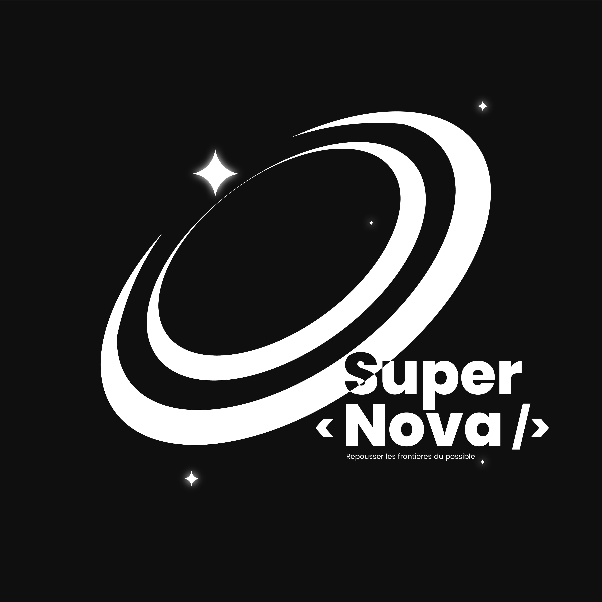

# TheEnd.page - Projet Webcup 2024 par l'équipe Supernova

## À propos du Projet

TheEnd.page est une plateforme innovante qui transforme les fins en expressions numériques créatives. Dans un monde où les adieux sont souvent maladroits ou oubliables, nous révolutionnons la façon dont les gens concluent leurs chapitres - que ce soit pour quitter un emploi, terminer un projet, clore une relation ou partir d'un serveur Discord.

## Notre Vision

Quand tout se termine, il y a toujours une dernière chose à dire. TheEnd.page offre la scène parfaite pour cette dernière déclaration, transformant les adieux en œuvres d'art numériques mémorables qui peuvent être :

- Émouvantes et touchantes
- Humoristiques et spirituelles
- Audacieuses et dramatiques
- Uniques et personnelles

## Fonctionnalités Principales

- **Pages de Fin Stylisées** : Créez des pages d'adieu magnifiquement conçues
- **Expression des Émotions** : Outils pour exprimer vos sentiments à travers texte, médias et éléments interactifs
- **Capacités de Partage** : Partage facile de vos déclarations finales sur les plateformes sociales
- **Assistance psychologique** : Assistance pour les personnes en difficulté psychologique
- **Bibliothèque de Modèles** : Divers modèles pour différents types d'adieux
- **Options de Personnalisation** : Rendez votre fin vraiment unique

## Stack Technique

- React + Vite pour le développement frontend
- Technologies web modernes pour une expérience utilisateur fluide
- Design responsive pour tous les appareils
- LLMA + Ngrok pour la génération de texte
- Firebase pour la gestion des utilisateurs et des données
- GitHub Actions pour le déploiement automatique

## Équipe Supernova

Nous sommes un groupe de développeurs passionnés participant à la Webcup 2024, dédiés à transformer la façon dont les gens disent au revoir. Car parfois, la fin n'est que le début d'une belle histoire.

- **Stevano** : Chef d'equipe, Développeur Frontend, UI/UX Designer, 3D Modeler
- **Junior** : Développeur fullstack
- **Kevin** : Développeur fullstack, 3D Modeler
- **Mahery** : Développeur Frontend, UI/UX Designer, 3D Modeler

_Parce que parfois, faire une sortie, c'est faire une déclaration._
